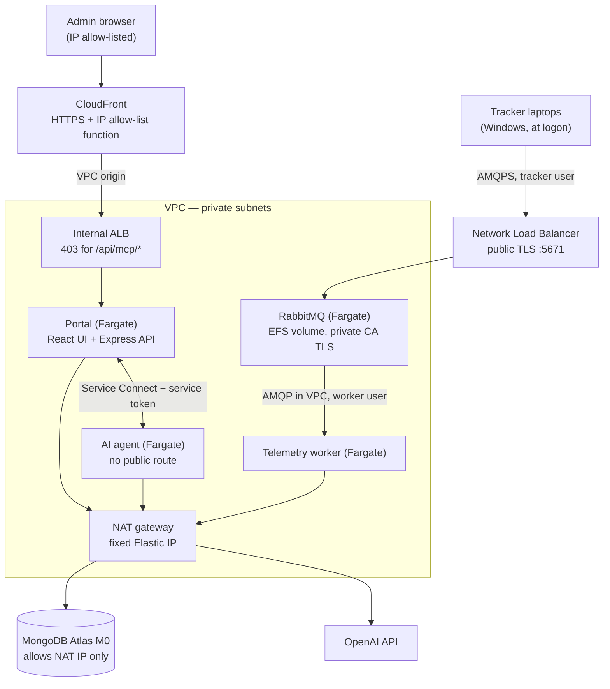
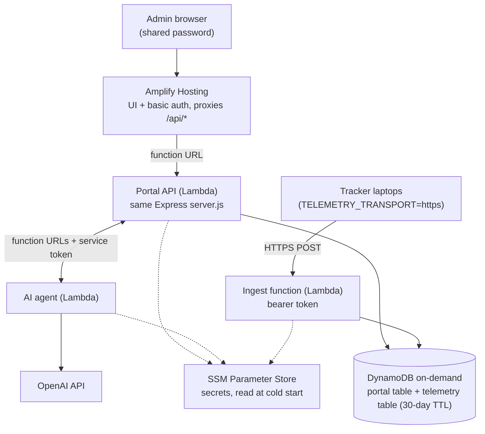

# AWS POC architecture

Two independent deployments of the same three repos (portal, AI agent, Tracker),
both defined in `infra/` (AWS CDK) in account `978387602501`, `us-east-1`.
Operational runbooks: [`infra/README.md`](../infra/README.md). Accepted gaps:
[`known-gaps.md`](known-gaps.md).

## Container deployment (`UsagePoc`) — currently shut down

Billed by the hour (≈ $135/month while running). Redeploy with the two-phase
runbook in `infra/README.md`.

| Concern | How it is handled |
|---|---|
| Portal access | CloudFront Function allow-list (`allowedCidrs` in `cdk.json`); ALB is internal |
| Agent-only API | `/api/mcp/*` denied at the ALB; agent calls the portal privately |
| Telemetry | Tracker → RabbitMQ over TLS (private CA, publish-only `tracker` user) → worker → MongoDB |
| Secrets | Secrets Manager; Atlas URI and OpenAI key kept outside the stack (`usage-poc/shared/*`) |
| Data | MongoDB Atlas (raw telemetry TTL 30 days) |

## Pay-per-use deployment (`UsagePocServerless`) — running

Nothing billed by the hour (≈ $0.40/month idle plus usage).

| Concern | How it is handled |
|---|---|
| Portal access | Amplify basic auth (one shared login). Lambda function URLs are public — see gap V1 |
| Data layer | Same `server.js` with `DATA_STORE=dynamodb`; `services/dynamoDatabase.js` maps the Mongo operations to DynamoDB, verified by `test/storeParity.test.js` |
| Telemetry | Tracker posts the same event envelope over HTTPS; stored once per device + timestamp |
| Secrets | SSM SecureString under `/usage-poc-sls/`; Amplify password in Secrets Manager |

## What is shared between the two

- One codebase per component; the deployment picks the database (`DATA_STORE`) and
  the Tracker picks the transport (`TELEMETRY_TRANSPORT`).
- The same portal UI build; both poll telemetry incrementally (`/api/telemetry?since=`).
- A laptop reports to one deployment at a time (`scripts\install-aws-poc.ps1 [-Target Serverless]`).
